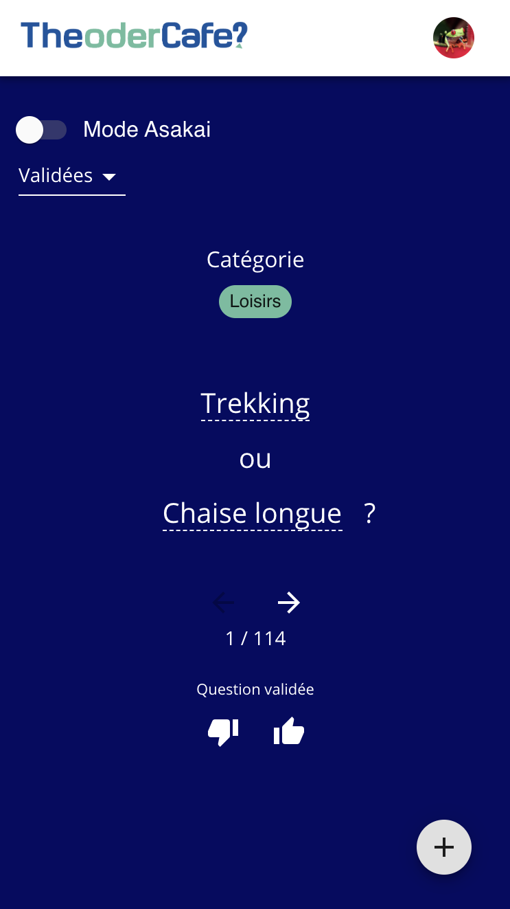

Fais tes choix sur [theodercafe.com](https://theodercafe.com)



## Install

### Backend

```
cd backend && cp .env.dev.dist .env.dev && cd ..
docker-compose up
docker exec -it backend sh
npm run migration:run
```

### Frontend

```
cd frontend
npm install
npm run start
```

## Backlog

- In asakai mode, merge postgre db votes with live firebase votes
- Display a single url for each question so they can be shared

## Database

- Dev
  `docker-compose exec postgresql psql -d theodercafe -U the`

* Prod
  `PGDATABASE=theodercafe gcloud sql connect theodercafe --user=the`
